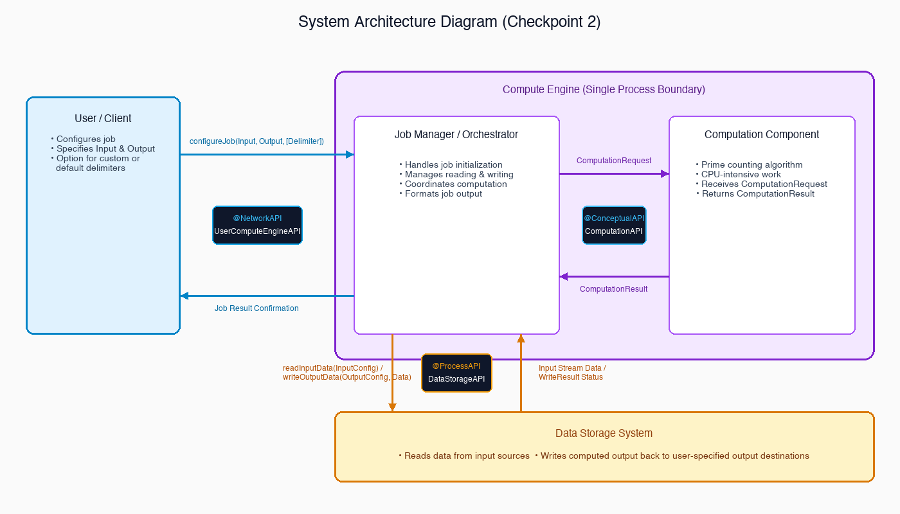

## Checkpoint 2: Draft the APIs

### 1. Computation Selection
**Count the Number of Prime Numbers Below the Input**

The chosen computation counts how many prime numbers are smaller than a given positive integer input.

- **Input Requirement**: A single positive integer greater than 0 and less than `Integer.MAX_VALUE`.
- **CPU Intensive Nature**: The prime counting algorithm checks each number below the input for primality via nested divisibility loops, making it CPU intensive for performance benchmarking.
- **Sample Input and Output**:

| Input | Prime Numbers Below Input | Output |
| ----- | ------------------------- | -----: |
| 10    | 2, 3, 5, 7                |      4 |
| 20    | 2, 3, 5, 7, 11, 13, 17, 19|      8 |
| 100   | 2, 3, 5, 7, ... , 97      |     25 |

---

### 2. System Architecture Diagram
The system architecture includes three distinct API boundaries:

1. **Network API (`UserComputeEngineAPI`)**: Network boundary between User/Client and the Compute Engine process.
2. **Process API (`DataStorageAPI`)**: Process boundary between Compute Engine (Job Manager) and Data Storage System, handling both reading input and writing computed output.
3. **Conceptual API (`ComputationAPI`)**: Conceptual boundary situated **inside** the Compute Engine process, connecting the Job Manager/Orchestrator to the Computation Component.

Each boundary features explicit request and response flows.

---

### 3. API Design & Key Features

- **Network API (`UserComputeEngineAPI`)**: Uses generic `InputConfig` and `OutputConfig` objects instead of hardcoded strings. Supports both custom delimiters via `DelimiterConfig` and optional default delimiters (`DelimiterConfig.defaultConfig()`).
- **Process API (`DataStorageAPI`)**: Provides methods to read input data (`readInputData`) AND write computed results back out (`writeOutputData`) using generic `InputConfig` and `OutputConfig` location objects.
- **Conceptual API (`ComputationAPI`)**: Operates inside the Compute Engine process. Wraps primitive values inside flexible objects (`ComputationRequest` and `ComputationResult`).
